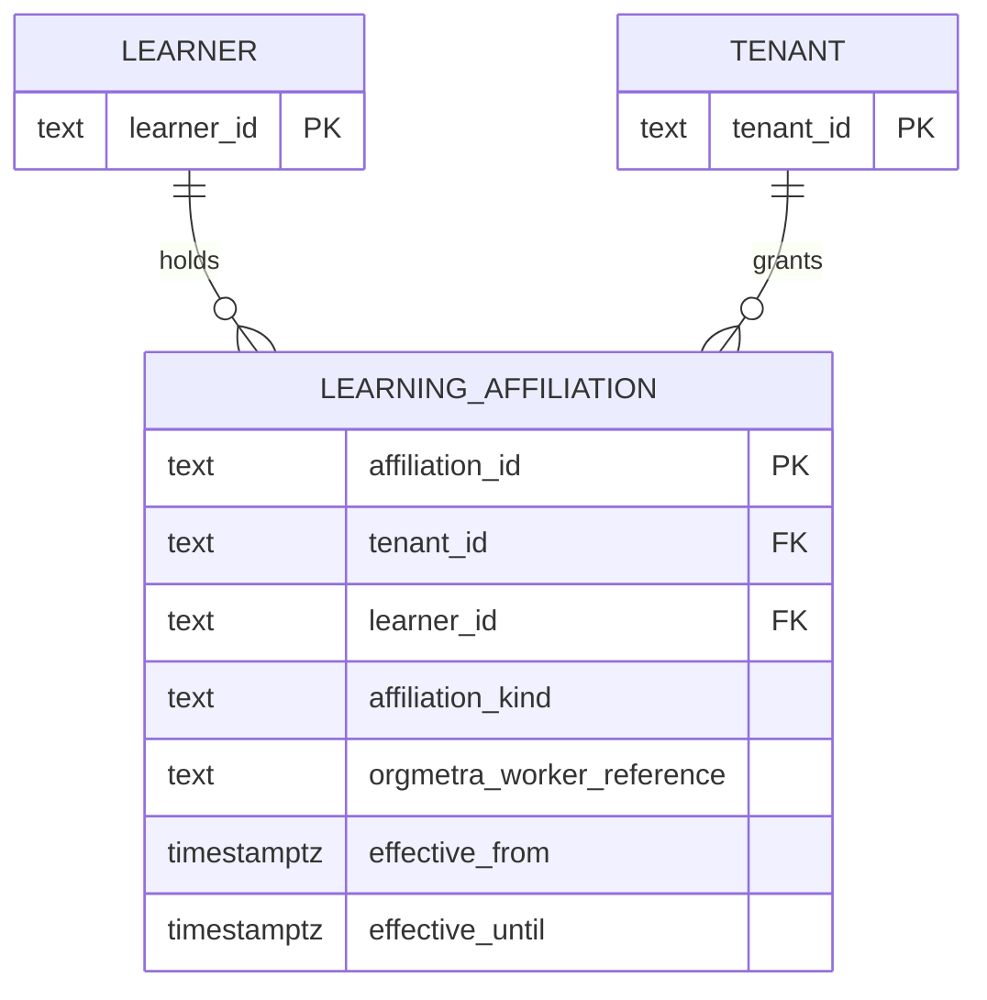

# Proposed ERD

No migration is released. This logical model guides the next persistence slice
and does not authorize a database object yet.

The physical PostgreSQL design must preserve 3NF, tenant-scoped uniqueness, an
exclusive end instant, and the employee-only worker-reference invariant. It
requires migration and rollback tests before adoption.

