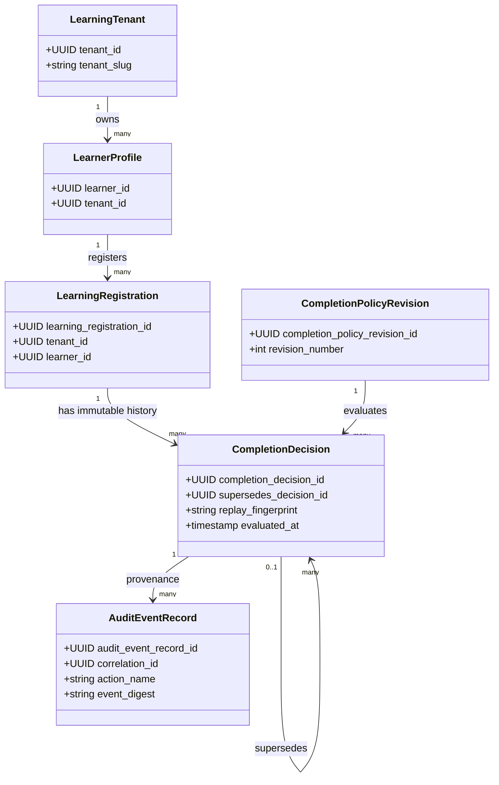

# UML and interaction baseline

This repository has no frontend surface yet, so there is no Figma file or
Storybook inventory for this slice. The diagrams describe the executable API
and persistence boundary; the first UI ADR must record its Figma file ID and
design-token/Storybook inventory.

## Completion correction sequence

```mermaid
sequenceDiagram
    participant Client
    participant API as lms_api
    participant DB as PostgreSQL/RLS
    participant Kernel as Rust kernel
    participant Audit as audit_event_record

    Client->>API: POST completion decision + optional supersedes_decision_id
    API->>DB: BEGIN; SET LOCAL app.tenant_id
    alt predecessor supplied
        API->>DB: verify same tenant, learner, registration
        DB-->>API: predecessor row or none
    end
    API->>DB: load policy revision and registration evidence
    API->>Kernel: evaluate_completion(policy, evidence, evaluated_at)
    Kernel-->>API: immutable decision + replay fingerprint
    API->>DB: INSERT new decision with predecessor relation
    API->>Audit: INSERT corrected or published provenance event
    API->>DB: COMMIT
    API-->>Client: decision response with supersedes_decision_id
```

## Domain and persistence relationships



The self-relation is directional: the new decision points to the predecessor;
no update of the predecessor is permitted.
