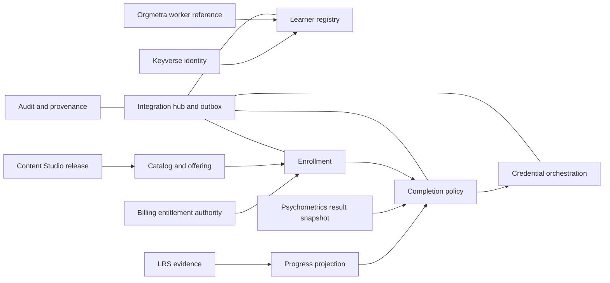

# Product and technical gap baseline

**As of:** 2026-08-20  
**Status:** Baseline for implementation planning; not a product-readiness or standards-conformance claim.

## Executive verdict

The repository began as a documentation bootstrap and is not yet a usable learning-management product. The buyer-facing opportunity is clear: let an employee, partner, customer, candidate, association member, or self-sponsored learner complete a course without manufacturing an HR record, while keeping identity, content, evidence, assessment, and billing truth in their owning systems. The current stacked implementation has an executable Rust/PostgreSQL affiliation, registration, enrollment, launch-attempt, progress-projection, policy-evaluation, completion-decision, and credential-reference kernel, but no released integration client, browser journey, assessment execution, or production test suite. The first commercial slice is therefore the external-learner registration-to-credential vertical, delivered behind versioned contracts and proven with real PostgreSQL and end-to-end tests.

The next customer-visible milestone is not another document: a tenant-isolated learner can be entitled, enrolled, launched, progress-tracked, assessed, and issued a reproducible completion result without an Orgmetra worker reference.

## Current-state evidence

| Evidence | Observed fact | Consequence |
|---|---|---|
| `develop@1b89a16bbbd6c4b7c6ee4e8b81e2c8c651d1ce2c` | Contains only the bootstrap `README.md`. | No runtime behavior exists on the base branch. |
| PR [#1](https://github.com/ContextualWisdomLab/learning-management-platform/pull/1), exact head `f77cd36247cb91b7e91e471776a63b03ba8a73bc` | Adds governance, architecture, data-model, ADR, standards, and quality-workflow documents. It remains open with `REVIEW_REQUIRED`; current checks are queued. | The bootstrap is not merged evidence and must not be described as implemented LMS behavior. |
| Failed run `32262959841` on predecessor head `1edc471` | The quality workflow required `docs/adr/0001-lms-authority-boundary.md`, while the committed ADR was `docs/adr/0001-learning-authority-boundary.md`. | PR commit `cdda6ec` corrects the shared path contract; a new exact-head green run is still required. |
| PR [#5](https://github.com/ContextualWisdomLab/learning-management-platform/pull/5), stacked on PR #4 | Adds the offering→entitlement→enrollment→registration adapter, tenant-scoped RLS, and the real PostgreSQL/API smoke path on top of the open kernel PR. | This is an open stacked implementation PR, not merged product evidence; current checks and independent review still gate it. |
| PR [#6](https://github.com/ContextualWisdomLab/learning-management-platform/pull/6) | Adds the tenant-safe effective-dated affiliation API and smoke coverage for partner learners. | It remains an open stacked PR; current checks and independent review gate it. |
| PR [#7](https://github.com/ContextualWisdomLab/learning-management-platform/pull/7) | Adds launch attempts, LRS-owned progress projections, and out-of-order observation protection. | It remains an open stacked PR; current checks and independent review gate it. |
| PR [#8](https://github.com/ContextualWisdomLab/learning-management-platform/pull/8), exact head `9e679f075cd77cf34e3287771fa6d3a4e5b7dd2d` | Connects policy revisions and external evidence references to the Rust completion engine and immutable decision persistence. | It remains open with checks/review pending; it is not merged product evidence. |
| PR [#9](https://github.com/ContextualWisdomLab/learning-management-platform/pull/9), exact head `a60ff94` | Adds tenant-safe credential reference issuance from a completed registration and exact completion decision. | It remains open with checks/review pending; it is not merged product evidence. |
| PR [#10](https://github.com/ContextualWisdomLab/learning-management-platform/pull/10), implementation head `cb9a636` | Adds idempotent tenant-safe credential revocation from the same exact registration and completion decision. | It remains open with checks/review pending; it is not merged product evidence. |
| PR [#11](https://github.com/ContextualWisdomLab/learning-management-platform/pull/11), implementation head `a2b72db` | Adds the versioned `assessment_result_reference/v1` boundary, external pass/fail status, and Rust rejection of non-passed assessment evidence. | It remains open with checks/review pending; it is not merged product evidence. |
| PR [#12](https://github.com/ContextualWisdomLab/learning-management-platform/pull/12), implementation head `899d2dd` | Adds registration-bound evidence references and idempotent assessment import retries. | It remains open with checks/review pending; it is not merged product evidence. |
| Issue [#2](https://github.com/ContextualWisdomLab/learning-management-platform/issues/2) | Defines the repository boundary, modular-monolith slices, PostgreSQL 3NF, adapters, accessibility, and evidence gates. | This is the foundation backlog, not delivered functionality. |
| Issue [#3](https://github.com/ContextualWisdomLab/learning-management-platform/issues/3) | Defines the external-learner vertical and acceptance criteria for identity separation, effective dating, replayable completion, tenancy, and coverage. | This is the first product slice to implement after the bootstrap merges. |

## Product requirements baseline

### First buyer journey

1. A tenant administrator creates or imports a course offering from an immutable content-release reference.
2. A learner enters through Keyverse or an approved external identity reference; no employee record is required.
3. The learner receives a sponsor- or self-funded entitlement projection and enrolls in the offering.
4. The LMS launches the registered learning activity and consumes progress projections from the LRS.
5. The learner completes the required activity and, when applicable, an assessment delegated to Psychometrics Commons.
6. A versioned completion policy evaluates immutable evidence references and publishes an immutable decision.
7. Credential orchestration issues a portable credential reference without copying source content, assessment payloads, or billing-provider truth.

### Roles that must not collapse

`learner_profile`, login identity, employee/worker reference, sponsor, payer, contracting organization, and credential beneficiary are separate concepts. One login identity may be linked to several tenant-scoped learner affiliations. A learner may have no worker reference, several effective-dated affiliations, or concurrent affiliations in different tenants.

### Acceptance slice

The first vertical is complete only when all of the following are demonstrated on an exact head:

- a non-employee learner completes the full registration-to-completion journey;
- an employee-linked learner follows the same path without special-case domain duplication;
- sponsor, payer, learner, identity, organization, and credential recipient remain distinguishable in API and database records;
- content release, LRS evidence, assessment result, identity, and billing objects remain external references;
- the completion result names the exact policy revision and immutable evidence references and can be replayed;
- cross-tenant reads and writes fail closed;
- repeated enrollment, concurrent affiliations, expiry, correction, replay, retry, and out-of-order integration events are tested;
- real PostgreSQL, browser E2E, security, migration/rollback, provenance, and observability evidence is attached to the candidate head.

## Technical target baseline

### Modular-monolith boundaries

The first implementation should remain one deployable service with explicit modules. Split repositories only when ownership, release cadence, or trust boundaries require independent deployment.

| Module | Owns | Must call |
|---|---|---|
| Tenant management | tenant lifecycle and isolation context | authorization context |
| Learner registry | learner profile and affiliations | Keyverse/Orgmetra references |
| Catalog and offering | catalog records, immutable release references, offerings | Learning Content Studio contract |
| Enrollment | entitlement-aware enrollment, registration, attempts | Billing and LRS contracts |
| Progress projection | local progress view and sync state | LRS contract |
| Completion policy | policy revisions, evidence references, immutable decisions | LRS and Psychometrics Commons contracts |
| Credential orchestration | credential issue/revoke projection | Open Badges/CLR-compatible contract |
| Integration hub | versioned API/event clients, idempotency, outbox, retries | all external authorities |
| Audit and provenance | actor, tenant, correlation, source, digest, decision history | authorization and observability |

### Data and time invariants

- Every tenant-owned table has a tenant key, and every cross-tenant foreign key includes the tenant boundary.
- Authoritative facts use third-normal-form relations with descriptive two-or-more-word `snake_case` names.
- Effective-dated relationships use `valid_from` and `valid_to`; facts that can be corrected after observation also retain transaction/observation metadata and a superseding relation.
- Completion policies are immutable revisions. A correction creates a new decision that points to the prior decision; it never rewrites published evidence.
- `decision_evidence_reference` stores source authority, opaque snapshot ID, digest, observed version, and decision-time metadata, never source payload copies.
- Entitlements are versioned local projections of external authority, never a second billing ledger.

### PostgreSQL and hot-partition baseline

Use PostgreSQL row-level security as a defense-in-depth tenant boundary, with application authorization and tenant-scoped foreign keys still required. Keep low-volume identity and enrollment tables ordinary until measurements justify partitioning. For append-heavy `audit_event_record`, `outbox_event_record`, and progress/evidence projection tables, use a measured multi-level strategy: time range partitions for retention plus a tenant hash bucket where a single tenant can create a hot partition. Every partitioned write path must have an index and retention/rollback test. A partition design is not accepted merely because it exists; load evidence must show bounded skew and no cross-tenant leakage.

### Integration contract baseline

No module may read another repository's application tables. Each external boundary needs a versioned OpenAPI or event schema, consumer/provider contract tests, idempotency key, correlation ID, observed source version, digest, retry policy, dead-letter handling, and a documented ownership decision. Until those artifacts exist, the boundary remains `planned`, not `implemented`.

### Security, privacy, accessibility, and operability

PII must remain usable for legitimate work without copying it into every service. The design uses least-privilege access, purpose- and tenant-scoped authorization, field-level audit, consent and retention policy, encrypted transport/storage, controlled break-glass access, and tokenized external references where a stable reference is sufficient. Masking is not the only control and must not make the learner journey unusable.

The future UI must target WCAG 2.2 AA, keyboard and screen-reader behavior, focus/error semantics, locale/time-zone consistency, and design tokens with a Storybook inventory. There is no UI surface in the current repository, so no Figma file or Figma ID is applicable to this baseline; create the ADR entry when the first user-facing flow is designed.

Production readiness requires CSAP and SOC 2 control mapping, SBOM and provenance, key rotation, backup/restore, migration rollback, rate limits, alerting, SLOs, audit export, and incident evidence. NIST CSF 2.0 is the control-organizing reference; it does not itself certify the service.

## Gap register and delivery order

| ID | Priority | Buyer-visible gap | Current evidence | Exit evidence | Next change |
|---|---:|---|---|---|---|
| G-01 | P0 | No merged executable LMS kernel or API | PR #4 open; local Rust/PostgreSQL/API smoke evidence exists | Running service with documented health and tenant context on merged exact head | Merge foundation stack after review/check gates |
| G-02 | P0 | No merged learner/identity/employee/sponsor/payer separation | PR #4 has learner, membership, offering, entitlement, and composite tenant keys; PR #6 adds effective-dated affiliation API coverage | Real PostgreSQL schema and integration tests for all roles | Add sponsor/payer role and authorization coverage |
| G-03 | P0 | No completed external learner journey | PR #5 implements offering through registration; PR #7 adds launch/progress; PR #8 adds completion decision persistence; PR #9 adds credential reference issuance; PR #10 adds revocation; PR #11 adds assessment result reference handoff; PR #12 adds retry safety | Non-employee journey passes browser/API E2E through completion and credential lifecycle | Add assessment execution/scoring, browser E2E, and released contracts |
| G-04 | P0 | No time-aware affiliation or correction model | Requirements only | Effective-dated and replay/correction tests pass | Add valid-time and decision transaction metadata |
| G-05 | P0 | No versioned external contracts | PR #11 adds the local `assessment_result_reference/v1` JSON schema/route; PR #12 adds registration binding and idempotent retries; no released provider client exists | Schemas, clients, provider-consumer contract tests, idempotent adapters | Add integration package, client, and outbox |
| G-06 | P0 | No deterministic completion/evidence engine | PR #8 evaluates versioned policy/evidence in Rust; PR #11 rejects failed or inconclusive assessment evidence; PR #12 binds evidence to registration | Replay produces the same decision from policy/evidence versions on a real database | Add correction/supersession and provider contract tests |
| G-07 | P1 | No provenance, audit, or operational evidence | No runtime source | Correlation-linked audit and decision history with export | Add audit/provenance module |
| G-08 | P1 | No PostgreSQL hot-partition, retention, or rollback evidence | PRs #4–#9 provide 3NF tables, composite tenant FKs, RLS, and one embedded migration | Migration, RLS, load, retention, and rollback evidence | Measure append-heavy projections before adding partitions |
| G-09 | P1 | No security/compliance control implementation | Standards profile only | CSAP/SOC 2/NIST control map with test receipts, SBOM, provenance | Add security and operability gates |
| G-10 | P1 | No accessibility/UI/design-system surface | No frontend files | Storybook, token tests, browser interaction and i18n evidence | Start UI only after API journey is real |
| G-11 | P1 | No realistic tests or coverage | No test tree | 100% owned statement/branch coverage plus edge and E2E evidence | Build tests with each vertical slice |
| G-12 | P2 | No release, rollback, or cross-repository ecosystem loop | One open PR and two open issues | Versioned release, changelog, scheduled queue/next-action evidence | Merge PRs, then consume highest-leverage issue |

## PR and issue loop

For every open PR: re-fetch the exact head, inspect all review threads, correct only valid findings, run local checks, wait for current checks without manufacturing evidence, then verify current-head approval and merge state before protected merge. After merge, re-fetch `develop`, select the highest-leverage open issue, create a small stack, and repeat. A green check is not a semantic approval; a merge is not runtime proof.

The current loop is:

1. PR #1: validate its current exact head, obtain an independent current-head review, then merge only when the live rules permit it.
2. Issue #2: add the executable modular-monolith foundation and repository gates.
3. Issue #3: stack the external-learner vertical on that foundation; PR #5 covers registration, PR #6 affiliation, PR #7 launch/progress, PR #8 completion persistence, PR #9 credential issuance, PR #10 credential revocation, PR #11 assessment-result reference handoff, and PR #12 retry/binding safety.
4. Add the product gaps found by runtime evidence as the next bounded PR, not as speculative scaffolding.

## Standards and research evidence

The standards profile remains planned adoption. The current authoritative pages support LTI 1.3 with LTI Advantage services AGS/NRPS/Deep Linking 2.0, QTI 3.0, CASE 1.1, Open Badges 3.0, and CLR 2.0. IEEE's current xAPI page identifies IEEE 9274.1.1-2023 as active and also links the ISO/IEC/IEEE 39274-1-1:2025 international standard; implementation must pin the exact purchased/accessible revision before claiming conformance. These standards provide interchange and contract targets, not proof that this repository implements them.

Learning-analytics research reinforces the product boundary: activity data are proxy signals and can create surveillance, aggregation, secondary-use, exclusion, distortion, and decisional-interference risks. Therefore, progress projections remain evidence references and cannot directly become high-stakes completion or employment decisions without an explicit, versioned policy and auditable human/tenant governance.

See `docs/doctoring/STANDARD_TRACEABILITY.md` for the adoption matrix, exact sources, APA 7 references, and evidence status.

## References (APA 7)

1EdTech Consortium. (n.d.). *Competencies and Academic Standards Exchange (CASE).* Retrieved August 20, 2026, from https://www.1edtech.org/standards/case

1EdTech Consortium. (n.d.). *Comprehensive Learner Record standard.* Retrieved August 20, 2026, from https://www.1edtech.org/standards/clr

1EdTech Consortium. (n.d.). *Learning Tools Interoperability (LTI).* Retrieved August 20, 2026, from https://www.1edtech.org/standards/lti

1EdTech Consortium. (n.d.). *Open Badges.* Retrieved August 20, 2026, from https://www.1edtech.org/standards/open-badges

1EdTech Consortium. (n.d.). *Question & Test Interoperability (QTI).* Retrieved August 20, 2026, from https://www.1edtech.org/standards/qti

Badiuzzaman, M. B., & Rahman, S. S. (2026). Beyond compliance: A Solove-informed analysis of tracking, profiling, and student privacy in learning management systems. *Frontiers in Education, 11*. https://doi.org/10.3389/feduc.2026.1871384

IEEE Standards Association. (2023). *IEEE Standard for learning technology—JavaScript Object Notation (JSON) data model format and Representational State Transfer (RESTful) web service for learner experience data tracking and access (IEEE Std 9274.1.1-2023).* https://standards.ieee.org/ieee/9274.1.1/7321/

National Institute of Standards and Technology. (2024). *The NIST Cybersecurity Framework (CSF) 2.0* (NIST CSWP 29). https://doi.org/10.6028/NIST.CSWP.29

PostgreSQL Global Development Group. (2026). *PostgreSQL 18 documentation: Row security policies; table partitioning.* https://www.postgresql.org/docs/current/ddl-rowsecurity.html; https://www.postgresql.org/docs/current/ddl-partitioning.html
